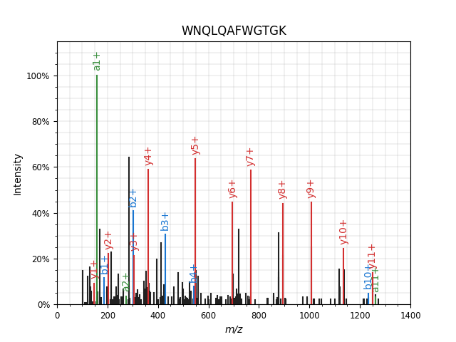

Example 4: Spectrum Annotation
==============================

In this example we will retrieve a spectrum and visualize it, a lot like in `example 2 <example_msms.html>`_.
However, we will not read the spectrum from a file, but retrieve it directly from an online repository.
We will also use Pyteomics to annotate fragment ions. Let's get to it! Full code can be downloaded
:download:`here <../_static/example_annotation.py>`.

We are going to need `spectrum_utils <https://github.com/bittremieux/spectrum_utils>`_, a library for spectrum
processing and visualization. Pyteomics integrates with it and allows to create annotated spectrum plots easily.

First, we use a spectrum's `Universal Spectrum Identifier <http://www.psidev.info/usi>`_ to download it
directly from the `MassIVE <https://massive.ucsd.edu/>`_ repository.
Pyteomics provides tools for that in the :py:mod:`pyteomics.usi` module.

.. literalinclude:: ../_static/example_annotation.py
    :language: python
    :lines: 1-6

Next, just plot the spectrum and annotate it with a single function call:

.. literalinclude:: ../_static/example_annotation.py
    :language: python
    :lines: 8-10

You will see a simple *spectrum_utils* annotation of the spectrum:

:py:func:`pyteomics.pylab_aux.annotate_spectrum` accepts a number of keyword parameters, allowing you to do just about
everything you can do with :py:mod:`spectrum_utils`.

.. note::
    You can omit `backend='spectrum_utils'`, and :py:func:`annotate_spectrum` will use the default backend.
    The default backend supports less spectrum preprocessing features.

Another thing *spectrum_utils* lets you do is mirror plots. Following the `spectrum_utils documentation
<https://spectrum-utils.readthedocs.io/en/latest/plotting.html#mirror-plot>`_, we are going to make this part more
complex, showing more of what you can do. This example includes modified peptides and a bit of spectrum preprocessing.

To annotate the spectrum of a modified peptide, you can use the *spectrum_utils* notation, but you can also
use the *modX* notation which is standard for Pyteomics:

.. literalinclude:: ../_static/example_annotation.py
    :language: python
    :lines: 12-15

Next, choose two spectra:

.. literalinclude:: ../_static/example_annotation.py
    :language: python
    :lines: 17-21

And finally, produce the image with:

.. literalinclude:: ../_static/example_annotation.py
    :language: python
    :lines: 23-26

Here's the result:

.. raw:: html
   :file: ../_static/mirror.html
