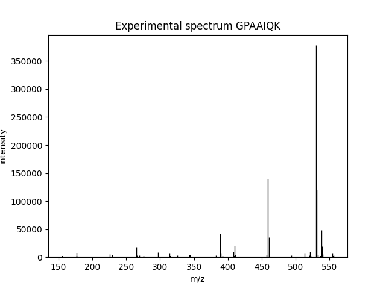
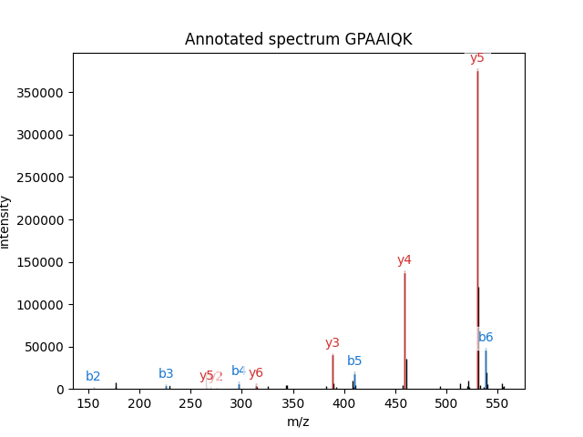
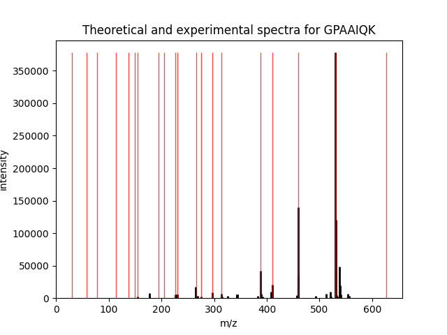

Example 2: Fragmentation
========================

.. note::
    Check `example 4 <example_annotation.html>`_ for more info about spectrum annotation.

In this example, we are going to retrieve MS/MS data from an MGF file and
compare it to identification info we read from a pepXML file. We are going to
compare the MS/MS spectrum in the file with the theoretical spectrum of a
peptide assigned to this spectrum by the search engine.

The script source can be downloaded :download:`here <../_static/example_msms.py>`. We will
also need the :download:`example MGF file <../_static/example.mgf>` and the
:download:`example pepXML file <../_static/example.pep.xml>`, but the script will download
them for you.

The MGF file has a single MS/MS spectrum in it. This spectrum is taken from the
`SwedCAD database of annotated MS/MS spectra <http://www.ncbi.nlm.nih.gov/pubmed/17711326>`_.
The pepXML file was obtained by running X!Tandem against the MGF file and
converting the results to pepXML with
`the Tandem2XML tool from TPP <http://tools.proteomecenter.org/wiki/index.php?title=Software:Tandem2XML>`_.

Let's start with importing the modules.

.. literalinclude:: ../_static/example_msms.py
    :language: python
    :lines: 1-4

Then we'll download the files, if needed. Run this if you're following along on your local machine.
Otherwise, just skip this part and suppose we have `example.mgf` and `example.pep.xml` in the working directory.

.. literalinclude:: ../_static/example_msms.py
    :language: python
    :lines: 7-15

We're all set!
First of all, let's read the single spectrum and the corresponding PSM from the files.

.. literalinclude:: ../_static/example_msms.py
    :language: python
    :lines: 17-19

Suppose we just want to visualize the spectrum from MGF. That's easy!

.. literalinclude:: ../_static/example_msms.py
    :language: python
    :lines: 21-22

At this point, a figure will be created, looking like this:

You may not see the figure until you call :py:func:`pylab.show` in the end, depending on your environment.

What if we want to see which peaks actually match the assigned peptide? That is what we call
spectrum annotation and it is also easily done:

.. literalinclude:: ../_static/example_msms.py
    :language: python
    :lines: 24-27

Here's what you get:

As you can see, :py:func:`pylab_aux.annotate_spectrum` needs a spectrum and a peptide sequence.
Check `example 4 <example_annotation.html>`_ for more info about spectrum annotation.

Now, suppose we want something else: see *all* theoretical and observed peaks. There is no readily available
function for this, so we'll have to implement calculation of fragment masses.
We will use
:py:func:`pyteomics.mass.fast_mass`:

.. literalinclude:: ../_static/example_msms.py
    :language: python
    :lines: 29-42

So, the outer loop is over "fragmentation sites", the next one is over ion
types, then over charges, and lastly over two parts of the sequence
(C- and N-terminal).

We will use the same function :py:func:`pylab_aux.plot_spectrum` to plot both experimental and theoretical peaks
in the same figure. For this, we need to mock a theoretical "spectrum" in the format that the function expects,
which is a dictionary with two most important keys, "m/z array" and "intensity array".
We don't have predicted intensities, so we'll use the maximum intensity from the experimental spectrum:

.. literalinclude:: ../_static/example_msms.py
    :language: python
    :lines: 44-45

The rest is easy. Plot two spectra (and tweak them so they're two different colors), then call :py:func:`pylab.show`
to see all figures:

.. literalinclude:: ../_static/example_msms.py
    :language: python
    :lines: 47-51

The final figure will look like this:

That's it, as you can see, the most intensive peaks in the spectrum are indeed
matched by the theoretical spectrum.
