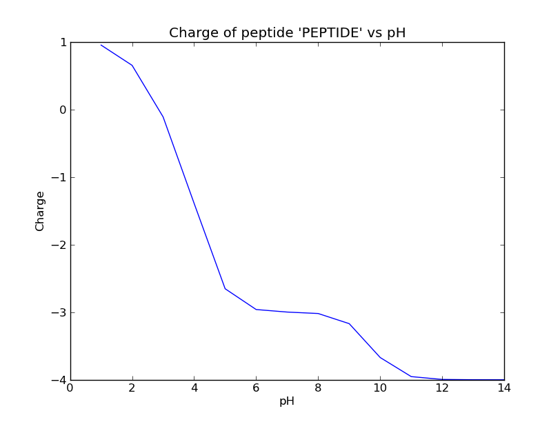

Charge and pI
=============

Electrochemical properties of polypeptides are covered in the
:py:mod:`electrochem.py` module.  For now, it allows to calculate

  *  the charge of a polypeptide at given pH;
  *  the isoelectric point.

Examples:
---------

::

        >>> from pyteomics.electrochem import charge
        >>> charge('PEPTIDE', 7)
        -2.9980189709606284
        >>> from pyteomics.parser import parse_sequence
        >>> charge(parse_sequence('PEPTIDE', show_unmodified_termini=True), 7)
        -2.9980189709606284
        >>> from pyteomics.parser import amino_acid_composition
        >>> charge(amino_acid_composition('PEPTIDE', show_unmodified_termini=True), 7)
        -2.9980189709606284

The following example plots the charge of peptide ‘PEPTIDE’ vs pH.
       
::

    >>> from pyteomics.electrochem import charge
    >>> pHs = range(1,15) # list of values of pH
    >>> charges = charge('PEPTIDE', pHs) # charge function supports lists of pHs
    >>> import pylab     # a powerful module for graphical data representation and more
    >>> pylab.figure()     # create a figure object
    >>> pylab.plot(pHs, charges)         # draw a plot of charges vs pHs
    >>> pylab.title("Charge of peptide 'PEPTIDE' vs pH")     #add title for the figure
    >>> pylab.xlabel('pH')        # add label for the X axis
    >>> pylab.ylabel('Charge')     # add label for the Y axis
    >>> pylab.show()     # show the figure

You should get something like this:

.. note::

    You can play with the style of the plot (linewidth, color, etc) by providing
    additional arguments to the plot function. See the :py:func:`pylab.plot`
    docstring for further info.

The following example demonstates the use of :py:func:`pI` function::

    >>> from pyteomics.electrochem import pI
    >>> pI('PEPTIDE')
    2.87451171875
    >>> pI('PEPTIDE', precision_pI=0.0001)
    2.876354217529297

.. note:: 

    :py:func:`pI` supports input in three formats, just like :py:func:`charge`.

